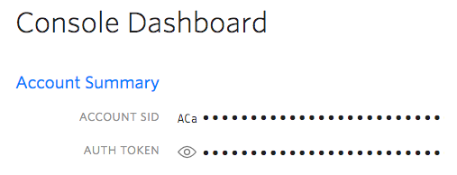
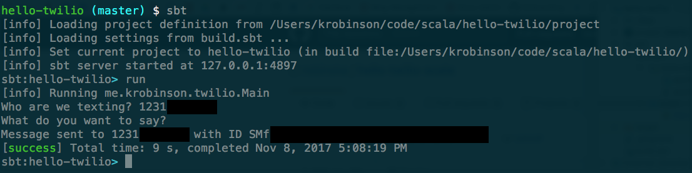

# Hello, Twilio!

A simple application for sending text messages with Scala & [Twilio](http://twilio.com)

**Full tutorial here: [https://www.twilio.com/blog/2017/11/getting-started-with-scala-and-twilio.html](https://www.twilio.com/blog/2017/11/getting-started-with-scala-and-twilio.html)**

## Set up

Sign up for a Twilio.com account if you don't already have one: [twilio.com/console](http://www.twilio.com/console)

```
cp src/main/resources/application.conf.example src/main/resources/application.conf
```

Edit your application.conf and add your account credentials, you can find those in the [console](http://www.twilio.com/console):



## Run

Run using [sbt](http://www.scala-sbt.org/) as seen below:



Et Voilà!


